# Aula 01 — Desenvolvimento para Dispositivos Móveis

> Conteúdo extraído automaticamente do arquivo `Aula01.pptx` (slides renderizados em imagem).

## Sumário

- [01. Desenvolvimento para dispositivos móveis](#01-desenvolvimento-para-dispositivos-móveis)
- [02. Slide 02](#02-slide-02)
- [03. O que é um dispositivo móvel?](#03-o-que-é-um-dispositivo-móvel)
- [04. Tipos de dispositivos móveis](#04-tipos-de-dispositivos-móveis)
- [05. Sistemas operacionais para dispositivos móveis](#05-sistemas-operacionais-para-dispositivos-móveis)
- [06. Fonte: https://gs.statcounter.com/os-market-share/mobile/brazil](#06-fonte-httpsgsstatcountercomos-market-sharemobilebrazil)
- [07. Fonte: https://gs.statcounter.com/os-market-share/mobile/worldwide](#07-fonte-httpsgsstatcountercomos-market-sharemobileworldwide)
- [08. A cada dia mais móvel](#08-a-cada-dia-mais-móvel)
- [09. Computação Ubíqua e Pervasiva](#09-computação-ubíqua-e-pervasiva)
- [10. Computação Ubíqua e Pervasiva](#10-computação-ubíqua-e-pervasiva)
- [11. Desafios no Desenvolvimento para Dispositivos Móveis](#11-desafios-no-desenvolvimento-para-dispositivos-móveis)
- [12. Técnicas de Interação com Dispositivos Móveis](#12-técnicas-de-interação-com-dispositivos-móveis)
- [13. Técnicas de Interação com Dispositivos Móveis](#13-técnicas-de-interação-com-dispositivos-móveis)
- [14. Desenvolvendo para dispositivos móveis](#14-desenvolvendo-para-dispositivos-móveis)
- [15. Desenvolvendo para dispositivos móveis](#15-desenvolvendo-para-dispositivos-móveis)
- [16. Ambientes](#16-ambientes)
- [17. Ambientes - Web App](#17-ambientes---web-app)
- [18. Ambientes - Web Apps](#18-ambientes---web-apps)
- [19. Ambientes - Web Apps](#19-ambientes---web-apps)
- [20. Ambientes - Web Apps](#20-ambientes---web-apps)
- [21. Ambientes - Web Apps](#21-ambientes---web-apps)
- [22. Ambientes - Web Apps](#22-ambientes---web-apps)
- [23. Ambientes - Native App](#23-ambientes---native-app)
- [24. Ambientes - Native App](#24-ambientes---native-app)
- [25. Ambientes - Native App](#25-ambientes---native-app)
- [26. Ambientes - Native App](#26-ambientes---native-app)
- [27. Ambientes - Native App](#27-ambientes---native-app)
- [28. Ambientes - Native App](#28-ambientes---native-app)
- [29. Ambientes - Native App](#29-ambientes---native-app)
- [30. Ambientes - Hybrid Apps](#30-ambientes---hybrid-apps)
- [31. Ambientes - Hybrid Apps](#31-ambientes---hybrid-apps)
- [32. Ambientes - Hybrid Apps](#32-ambientes---hybrid-apps)
- [33. Ambientes - Hybrid Apps](#33-ambientes---hybrid-apps)
- [34. Ambientes - Hybrid Apps](#34-ambientes---hybrid-apps)
- [35. Ambientes - Hybrid Apps](#35-ambientes---hybrid-apps)
- [36. Ambientes - Hybrid Apps](#36-ambientes---hybrid-apps)
- [37. Hoje](#37-hoje)

---

## 01. Desenvolvimento para dispositivos móveis

Texto extraído (para busca/copiar)

- Desenvolvimento para dispositivos móveis
- Prof. Nelson Bellincanta Fº.

---

## 02. Slide 02

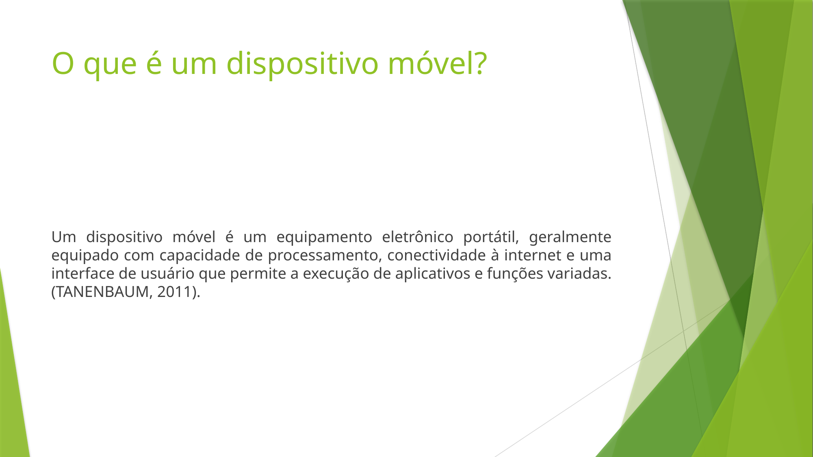

---

## 03. O que é um dispositivo móvel?

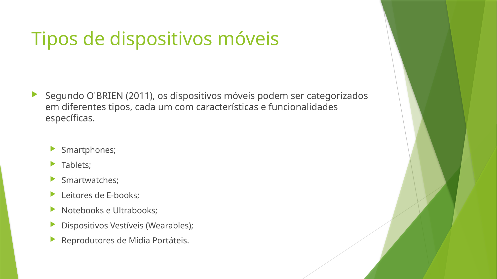

Texto extraído (para busca/copiar)

- O que é um dispositivo móvel?
- Um dispositivo móvel é um equipamento eletrônico portátil, geralmente equipado com capacidade de processamento, conectividade à internet e uma interface de usuário que permite a execução de aplicativos e funções variadas. (TANENBAUM, 2011).

---

## 04. Tipos de dispositivos móveis

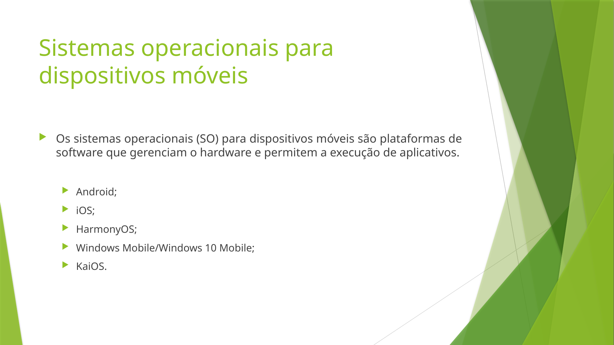

Texto extraído (para busca/copiar)

- Tipos de dispositivos móveis
- Segundo O'BRIEN (2011), os dispositivos móveis podem ser categorizados em diferentes tipos, cada um com características e funcionalidades específicas.
  - Smartphones;
  - Tablets;
  - Smartwatches;
  - Leitores de E-books;
  - Notebooks e Ultrabooks;
  - Dispositivos Vestíveis (Wearables);
  - Reprodutores de Mídia Portáteis.

---

## 05. Sistemas operacionais para dispositivos móveis

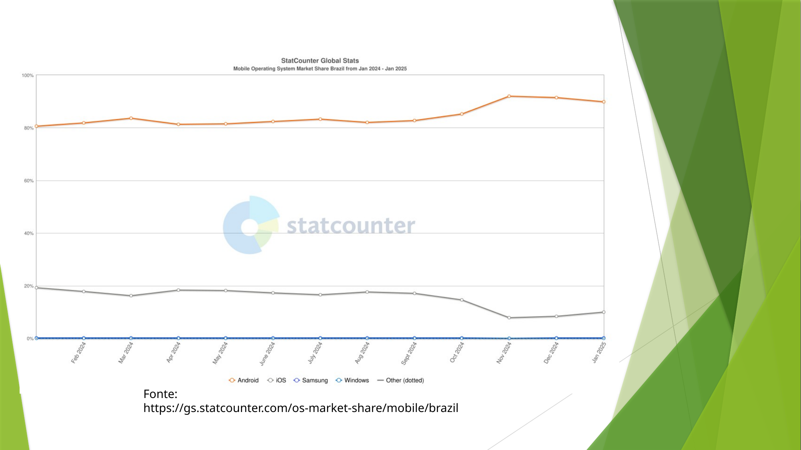

Texto extraído (para busca/copiar)

- Sistemas operacionais para dispositivos móveis
- Os sistemas operacionais (SO) para dispositivos móveis são plataformas de software que gerenciam o hardware e permitem a execução de aplicativos.
  - Android;
  - iOS;
  - HarmonyOS;
  - Windows Mobile/Windows 10 Mobile;
  - KaiOS.

---

## 06. Fonte: https://gs.statcounter.com/os-market-share/mobile/brazil

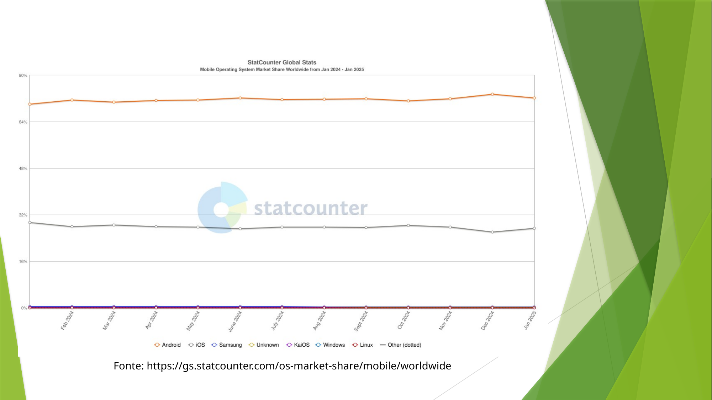

Texto extraído (para busca/copiar)

- Fonte: https://gs.statcounter.com/os-market-share/mobile/brazil

---

## 07. Fonte: https://gs.statcounter.com/os-market-share/mobile/worldwide

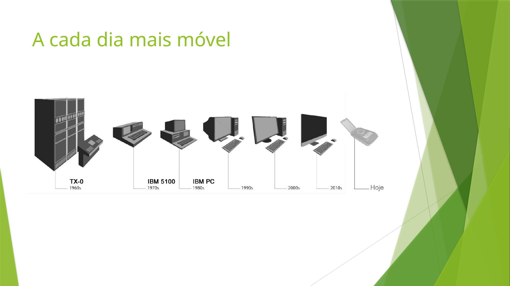

Texto extraído (para busca/copiar)

- Fonte: https://gs.statcounter.com/os-market-share/mobile/worldwide

---

## 08. A cada dia mais móvel

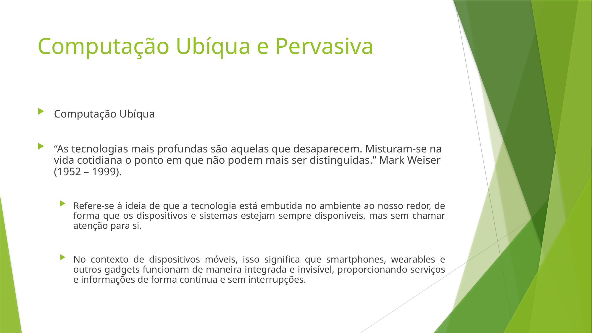

Texto extraído (para busca/copiar)

- A cada dia mais móvel

---

## 09. Computação Ubíqua e Pervasiva

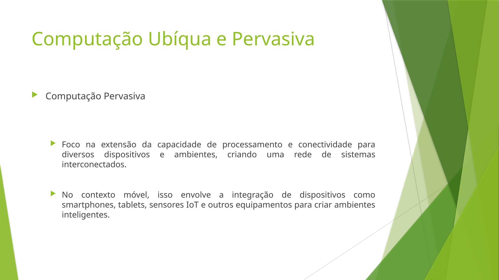

Texto extraído (para busca/copiar)

- Computação Ubíqua e Pervasiva
- Computação Ubíqua
- “As tecnologias mais profundas são aquelas que desaparecem. Misturam-se na vida cotidiana o ponto em que não podem mais ser distinguidas.” Mark Weiser (1952 – 1999).
  - Refere-se à ideia de que a tecnologia está embutida no ambiente ao nosso redor, de forma que os dispositivos e sistemas estejam sempre disponíveis, mas sem chamar atenção para si.
  - No contexto de dispositivos móveis, isso significa que smartphones, wearables e outros gadgets funcionam de maneira integrada e invisível, proporcionando serviços e informações de forma contínua e sem interrupções.

---

## 10. Computação Ubíqua e Pervasiva

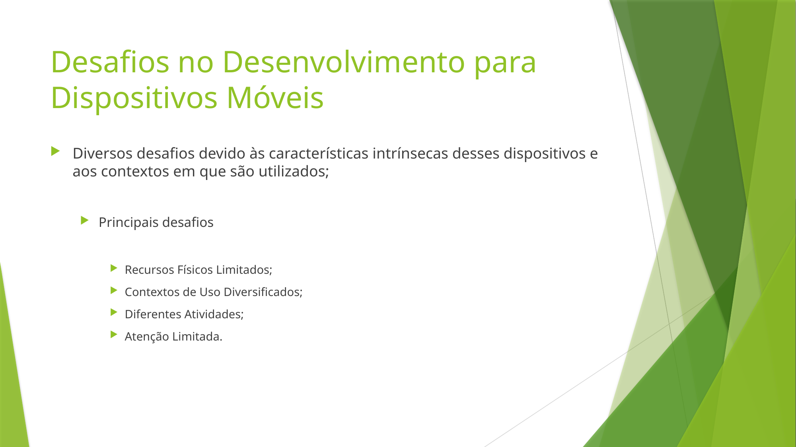

Texto extraído (para busca/copiar)

- Computação Ubíqua e Pervasiva
- Computação Pervasiva
  - Foco na extensão da capacidade de processamento e conectividade para diversos dispositivos e ambientes, criando uma rede de sistemas interconectados.
  - No contexto móvel, isso envolve a integração de dispositivos como smartphones, tablets, sensores IoT e outros equipamentos para criar ambientes inteligentes.

---

## 11. Desafios no Desenvolvimento para Dispositivos Móveis

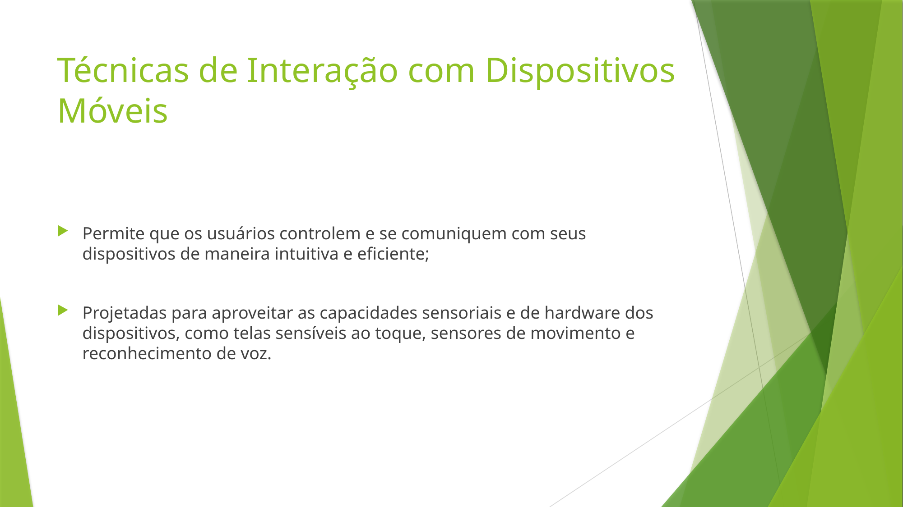

Texto extraído (para busca/copiar)

- Desafios no Desenvolvimento para Dispositivos Móveis
- Diversos desafios devido às características intrínsecas desses dispositivos e aos contextos em que são utilizados;
  - Principais desafios
    - Recursos Físicos Limitados;
    - Contextos de Uso Diversificados;
    - Diferentes Atividades;
    - Atenção Limitada.

---

## 12. Técnicas de Interação com Dispositivos Móveis

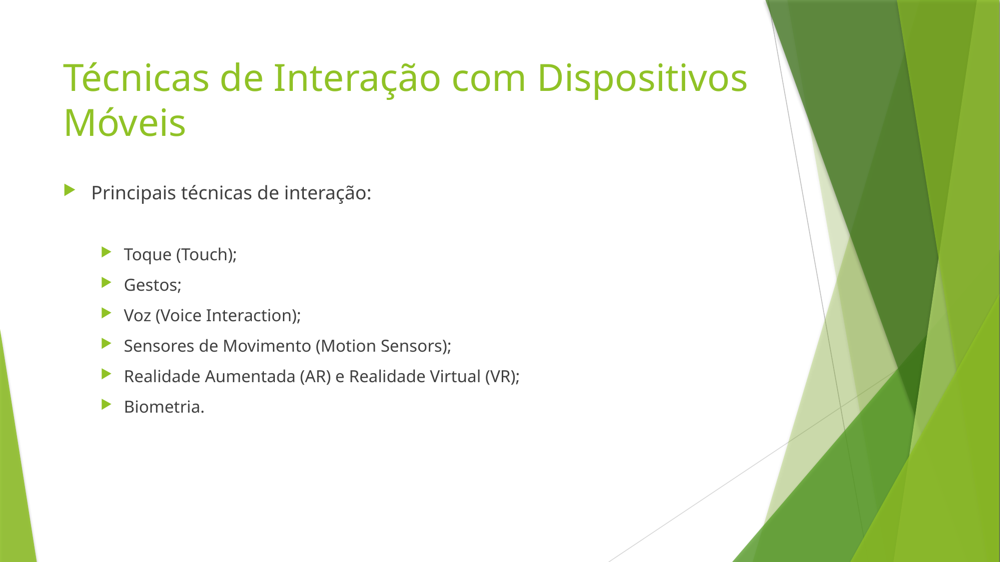

Texto extraído (para busca/copiar)

- Técnicas de Interação com Dispositivos Móveis
- Permite que os usuários controlem e se comuniquem com seus dispositivos de maneira intuitiva e eficiente;
- Projetadas para aproveitar as capacidades sensoriais e de hardware dos dispositivos, como telas sensíveis ao toque, sensores de movimento e reconhecimento de voz.

---

## 13. Técnicas de Interação com Dispositivos Móveis

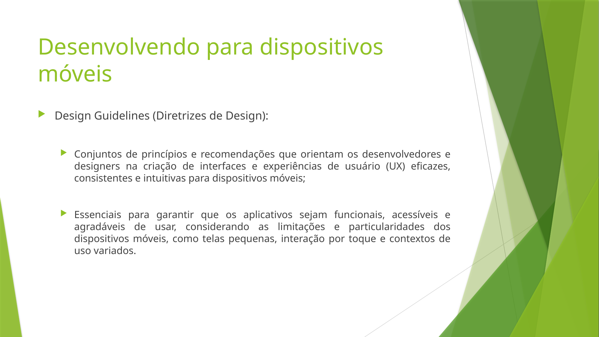

Texto extraído (para busca/copiar)

- Técnicas de Interação com Dispositivos Móveis
- Principais técnicas de interação:
  - Toque (Touch);
  - Gestos;
  - Voz (Voice Interaction);
  - Sensores de Movimento (Motion Sensors);
  - Realidade Aumentada (AR) e Realidade Virtual (VR);
  - Biometria.

---

## 14. Desenvolvendo para dispositivos móveis

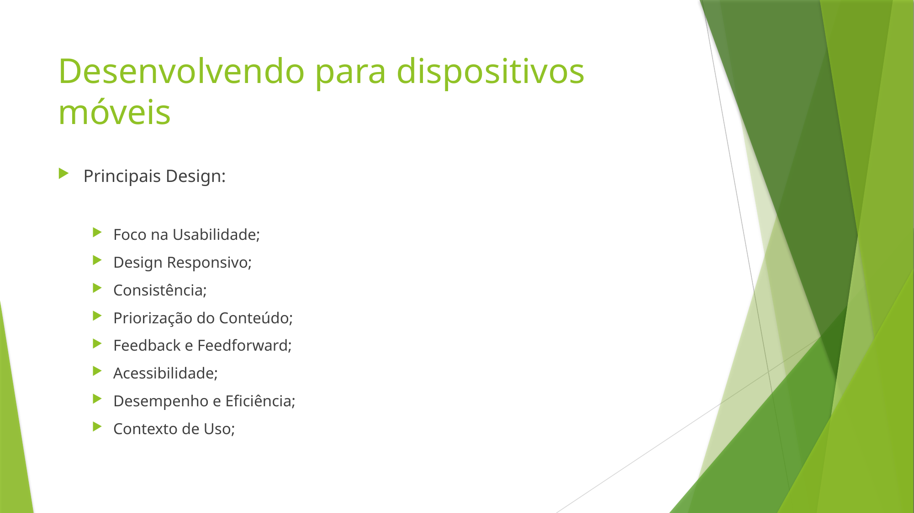

Texto extraído (para busca/copiar)

- Desenvolvendo para dispositivos móveis
- Design Guidelines (Diretrizes de Design):
  - Conjuntos de princípios e recomendações que orientam os desenvolvedores e designers na criação de interfaces e experiências de usuário (UX) eficazes, consistentes e intuitivas para dispositivos móveis;
  - Essenciais para garantir que os aplicativos sejam funcionais, acessíveis e agradáveis de usar, considerando as limitações e particularidades dos dispositivos móveis, como telas pequenas, interação por toque e contextos de uso variados.

---

## 15. Desenvolvendo para dispositivos móveis

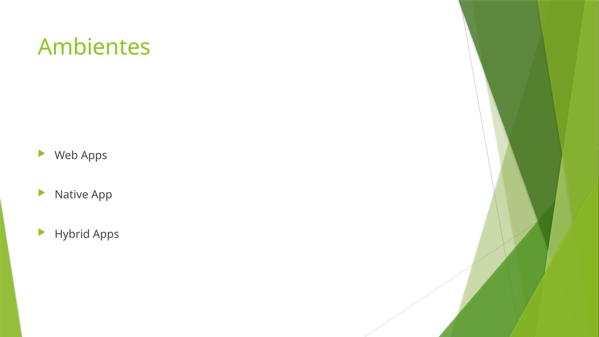

Texto extraído (para busca/copiar)

- Desenvolvendo para dispositivos móveis
- Principais Design:
  - Foco na Usabilidade;
  - Design Responsivo;
  - Consistência;
  - Priorização do Conteúdo;
  - Feedback e Feedforward;
  - Acessibilidade;
  - Desempenho e Eficiência;
  - Contexto de Uso;

---

## 16. Ambientes

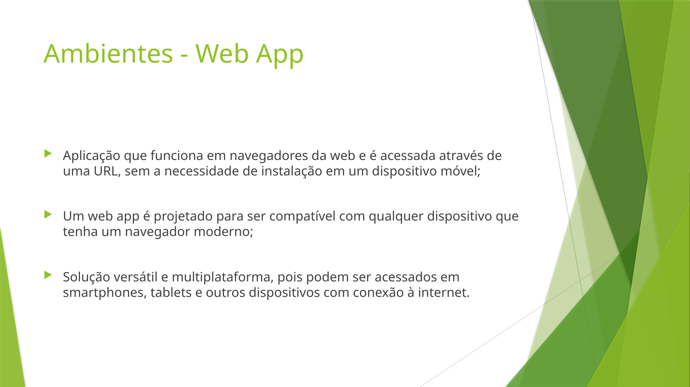

Texto extraído (para busca/copiar)

- Ambientes
- Web Apps
- Native App
- Hybrid Apps

---

## 17. Ambientes - Web App

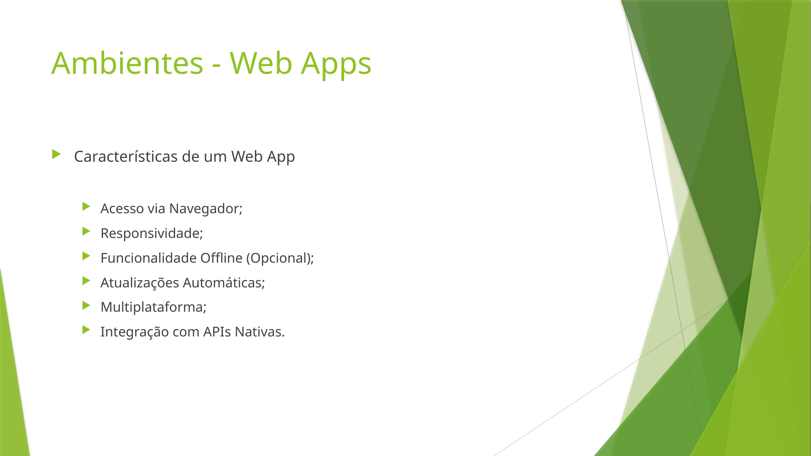

Texto extraído (para busca/copiar)

- Ambientes - Web App
- Aplicação que funciona em navegadores da web e é acessada através de uma URL, sem a necessidade de instalação em um dispositivo móvel;
- Um web app é projetado para ser compatível com qualquer dispositivo que tenha um navegador moderno;
- Solução versátil e multiplataforma, pois podem ser acessados em smartphones, tablets e outros dispositivos com conexão à internet.

---

## 18. Ambientes - Web Apps

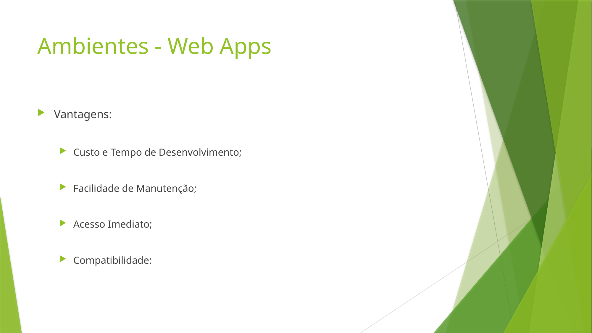

Texto extraído (para busca/copiar)

- Ambientes - Web Apps
- Características de um Web App
  - Acesso via Navegador;
  - Responsividade;
  - Funcionalidade Offline (Opcional);
  - Atualizações Automáticas;
  - Multiplataforma;
  - Integração com APIs Nativas.

---

## 19. Ambientes - Web Apps

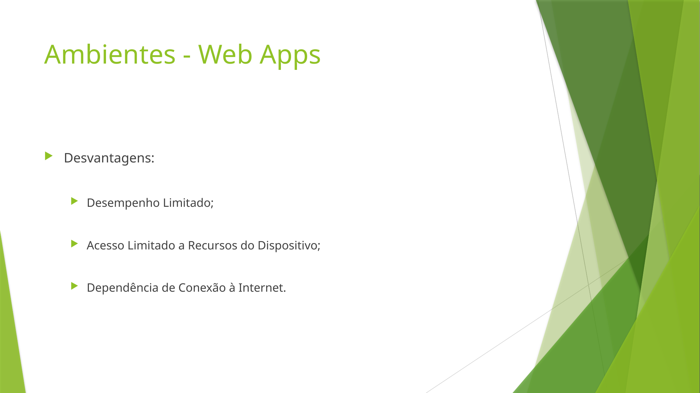

Texto extraído (para busca/copiar)

- Ambientes - Web Apps
- Exemplos:
  - Google Docs;
  - Spotify Web Player;
  - Trello.

---

## 20. Ambientes - Web Apps

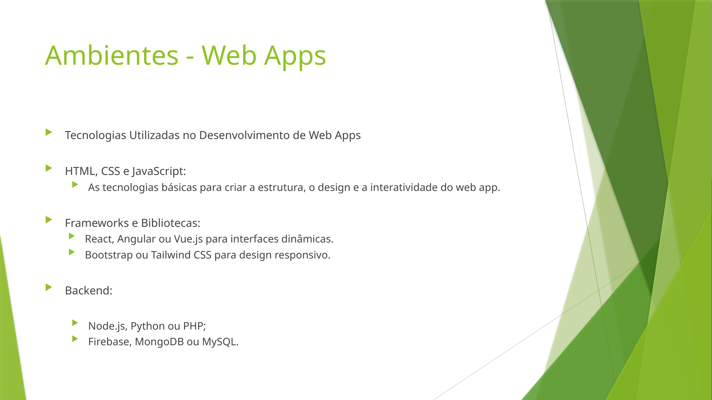

Texto extraído (para busca/copiar)

- Ambientes - Web Apps
- Vantagens:
  - Custo e Tempo de Desenvolvimento;
  - Facilidade de Manutenção;
  - Acesso Imediato;
  - Compatibilidade:

---

## 21. Ambientes - Web Apps

Texto extraído (para busca/copiar)

- Ambientes - Web Apps
- Desvantagens:
  - Desempenho Limitado;
  - Acesso Limitado a Recursos do Dispositivo;
  - Dependência de Conexão à Internet.

---

## 22. Ambientes - Web Apps

*(Imagem do slide 22 não encontrada.)*

Texto extraído (para busca/copiar)

- Ambientes - Web Apps
- Tecnologias Utilizadas no Desenvolvimento de Web Apps
- HTML, CSS e JavaScript:
  - As tecnologias básicas para criar a estrutura, o design e a interatividade do web app.
- Frameworks e Bibliotecas:
  - React, Angular ou Vue.js para interfaces dinâmicas.
  - Bootstrap ou Tailwind CSS para design responsivo.
- Backend:
  - Node.js, Python ou PHP;
  - Firebase, MongoDB ou MySQL.

---

## 23. Ambientes - Native App

*(Imagem do slide 23 não encontrada.)*

Texto extraído (para busca/copiar)

- Ambientes - Native App
- Aplicativo móvel desenvolvido especificamente para uma plataforma ou sistema operacional, como iOS (Apple) ou Android (Google), utilizando linguagens de programação, ferramentas e frameworks nativos fornecidos pelos próprios desenvolvedores das plataformas.
- São otimizados para tirar proveito total das funcionalidades e do desempenho do dispositivo, oferecendo a melhor experiência possível ao usuário.
- Escolha ideal quando se busca alto desempenho, integração profunda com o sistema operacional e uma experiência de usuário consistente com as diretrizes de design da plataforma.

---

## 24. Ambientes - Native App

*(Imagem do slide 24 não encontrada.)*

Texto extraído (para busca/copiar)

- Ambientes - Native App
- Características dos Native Apps
  - Desenvolvimento Específico para a Plataforma;
  - Acesso Total aos Recursos do Dispositivo;
  - Desempenho Superior;
  - Experiência de Usuário Consistente;
  - Distribuição em Lojas de Aplicativos.

---

## 25. Ambientes - Native App

*(Imagem do slide 25 não encontrada.)*

Texto extraído (para busca/copiar)

- Ambientes - Native App
- Exemplos de Native Apps
  - WhatsApp;
  - Spotify;
  - Google Maps;
  - Instagram.

---

## 26. Ambientes - Native App

*(Imagem do slide 26 não encontrada.)*

Texto extraído (para busca/copiar)

- Ambientes - Native App
- Vantagens:
  - Desempenho Otimizado;
  - Acesso Completo a Recursos do Dispositivo;
  - Experiência de Usuário Consistente;
  - Segurança e Confiabilidade;
  - Suporte Offline.

---

## 27. Ambientes - Native App

*(Imagem do slide 27 não encontrada.)*

Texto extraído (para busca/copiar)

- Ambientes - Native App
- Desvantagens:
  - Custo e Tempo de Desenvolvimento:
  - Manutenção Complexa;
  - Distribuição Dependente de Lojas.

---

## 28. Ambientes - Native App

*(Imagem do slide 28 não encontrada.)*

Texto extraído (para busca/copiar)

- Ambientes - Native App
- Tecnologias e Ferramentas para Desenvolvimento de Native Apps
- iOS:
  - Linguagens: Swift, Objective-C.
  - Ferramentas: Xcode (IDE oficial da Apple);
  - Frameworks: UIKit, SwiftUI, CoreData.

---

## 29. Ambientes - Native App

*(Imagem do slide 29 não encontrada.)*

Texto extraído (para busca/copiar)

- Ambientes - Native App
- Tecnologias e Ferramentas para Desenvolvimento de Native Apps
- Android:
  - Linguagens: Kotlin, Java;
  - Ferramentas: Android Studio (IDE oficial do Google);
  - Frameworks: Android SDK, Jetpack Compose, Room.

---

## 30. Ambientes - Hybrid Apps

*(Imagem do slide 30 não encontrada.)*

Texto extraído (para busca/copiar)

- Ambientes - Hybrid Apps
- Aplicativos móveis que combinam elementos de apps nativos e web apps;
- Desenvolvidos usando tecnologias web padrão, como HTML, CSS e JavaScript, mas são encapsulados em um contêiner nativo que permite sua distribuição em lojas de aplicativos (como Google Play e App Store);
- Oferecem uma solução intermediária entre os apps nativos e os web apps;
- Escolha popular para equipes que desejam desenvolver aplicativos multiplataforma com um único código-base, reduzindo custos e tempo de desenvolvimento.

---

## 31. Ambientes - Hybrid Apps

*(Imagem do slide 31 não encontrada.)*

Texto extraído (para busca/copiar)

- Ambientes - Hybrid Apps
- Características:
  - Baseado em Tecnologias Web;
  - Contêiner Nativo;
  - Acesso a Recursos Nativos;
  - Multiplataforma;
  - Atualizações Facilitadas.

---

## 32. Ambientes - Hybrid Apps

*(Imagem do slide 32 não encontrada.)*

Texto extraído (para busca/copiar)

- Ambientes - Hybrid Apps
- Como Funciona o Desenvolvimento de Hybrid Apps:
  - Desenvolvimento do Código Web;
  - Uso de Frameworks;
  - Compilação e Distribuição;
  - Plugins para Funcionalidades Nativas

---

## 33. Ambientes - Hybrid Apps

*(Imagem do slide 33 não encontrada.)*

Texto extraído (para busca/copiar)

- Ambientes - Hybrid Apps
- Como Funciona o Desenvolvimento de Hybrid Apps:
  - Desenvolvimento do Código Web;
  - Uso de Frameworks;
  - Compilação e Distribuição;
  - Plugins para Funcionalidades Nativas

---

## 34. Ambientes - Hybrid Apps

*(Imagem do slide 34 não encontrada.)*

Texto extraído (para busca/copiar)

- Ambientes - Hybrid Apps
- Vantagens:
  - Custo e Tempo de Desenvolvimento Reduzidos;
  - Facilidade de Manutenção;
  - Acesso a Recursos Nativos;
  - Distribuição em Lojas de Aplicativos.

---

## 35. Ambientes - Hybrid Apps

*(Imagem do slide 35 não encontrada.)*

Texto extraído (para busca/copiar)

- Ambientes - Hybrid Apps
- Desvantagens:
  - Desempenho Inferior a Apps Nativos;
  - Dependência de Plugins;
  - Experiência de Usuário Menos Consistente.

---

## 36. Ambientes - Hybrid Apps

*(Imagem do slide 36 não encontrada.)*

Texto extraído (para busca/copiar)

- Ambientes - Hybrid Apps
- Tecnologias e Frameworks para Desenvolvimento de Hybrid Apps
  - Apache Cordova (PhoneGap);
  - Ionic;
  - React Native;
  - Flutter.

---

## 37. Hoje

*(Imagem do slide 37 não encontrada.)*

Texto extraído (para busca/copiar)

- Hoje

